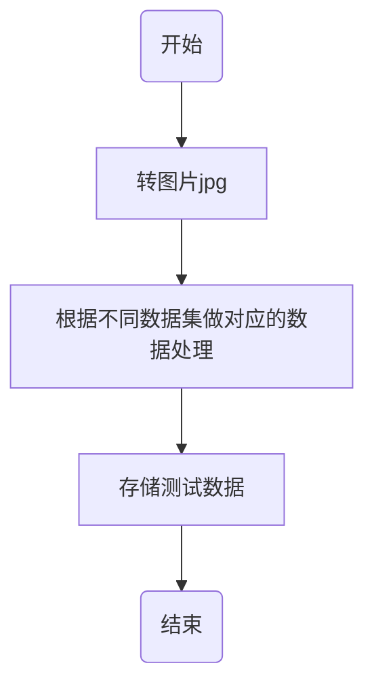
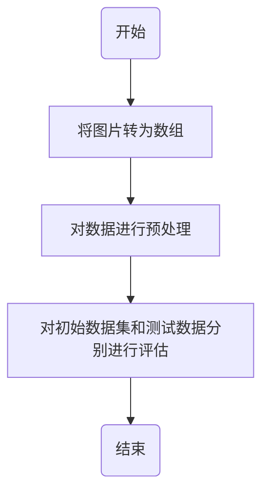
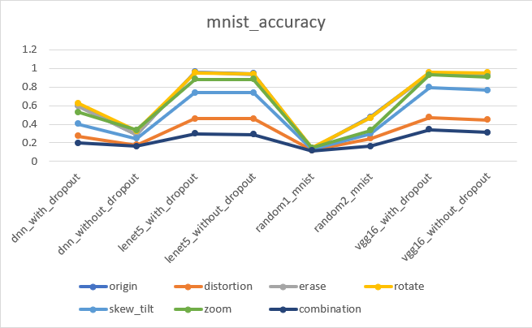
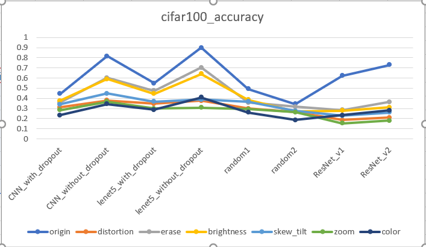

# 自动化测试AI方向大作业报告

脱晓彤 181250132

## 测试数据生成

- 本次大作业选择mnist和cifar100两个数据集。mnist是手写数字的图片，无颜色；cifar100是分成100类的彩色图片。

- 采用python编写，基于Augmentor库进行图像处理

- 代码思路：

  1. 将数据集转化为jpg形式的图片放在一个文件夹下
  2. 通过Augmentor库中的方法分别对两个数据集生成的图片进行处理，生成多组测试数据
  3. 在下述结果评估的部分将这些变异后的图片分别进行准确率评估


- 流程图


### 数据处理方法

#### mnist

- 旋转，向左最大旋转角度10，向右最大旋转角度10

  ```
  p.rotate(probability=1,max_left_rotation=10, max_right_rotation=10)
  ```

  由于mnist是手写数字，部分地方可能会有倾斜而影响识别，但是旋转角度不能过大，以防出现类似6和9互换的现象

- 透视、形变（上下左右方向的垂直形变）

  ```
  p.skew_tilt(probability=1,magnitude=0.4)
  ```

  magnitude取（0,1），指的是形变程度

- 弹性扭曲

  ```
  p.random_distortion(probability=1, grid_height=3, grid_width=3, magnitude=6)
  ```

  grid_height， grid_width，magnitude越大，形变程度越大

- 放大，最小为1.1倍，最大为1.6倍

  ```
  p.zoom(probability=1, min_factor=1.1, max_factor=1.6)
  ```

  保持图片尺寸不变

- 随机擦除

  ```
  p.random_erasing(probability=1,rectangle_area=0.2)
  ```

  随机遮挡图像部分地方，是一种使模型对遮挡更加鲁棒的技术。

- 将上述方法组合在一起，没有什么意义，主要是为了检测上述方法总效果

  

*说明：mnist是黑白图片，未加入对颜色的处理*，多为几何变换的处理

#### cifar100

- 放大，最小为1.1倍，最大为1.5倍，保持图片尺寸不变

- 透视、形变（同上）

- 弹性扭曲（同上）

- 随机擦除

  ```
  p.random_erasing(probability=1,rectangle_area=0.3)
  ```

  随机遮挡图像部分地方，是一种使模型对遮挡更加鲁棒的技术，这个对使用神经网络训练物体检测的时候非常有用

- 改变颜色

- ```
  p.random_color(probability=1,min_factor=1.5,max_factor=6)
  ```

  肉眼可识别，但参数或许还是设置过大

- 改变亮度

  ```
  p.random_brightness(probability=1,min_factor=1.1,max_factor=1.8)
  ```

  肉眼可识别

  

**说明：只将数据集X_train的前10000个数据转成图片，做了处理，生成的测试数据也是每组10000个，测试结果评估时也是只评估这10000个测试数据**

References：

1. https://augmentor.readthedocs.io/en/master/index.html
2. https://github.com/mdbloice/Augmentor

## 测试结果评估

- 代码思路：
  - 将测试数据生成的图片通过numpy转化为和数据集中X_train相同的表现形式。
  - 对数据进行预处理，包括归一化、独热编码等。（mnist中1、2模型和3~8模型有一个方法不同）
  - 对X_train和新的测试数据分别进行评估。

- 流程图



- 评估结果如下所示（origin代表初始数据集）

  - mnist

  |                        | origin | distortion | erase  | rotate | skew_tilt | zoom   | combination |
  | ---------------------- | ------ | ---------- | ------ | ------ | --------- | ------ | ----------- |
  | dnn_with_dropout       | 0.6008 | 0.2704     | 0.5959 | 0.6227 | 0.402     | 0.5299 | 0.199       |
  | dnn_without_dropout    | 0.287  | 0.1759     | 0.2846 | 0.3302 | 0.2443    | 0.3364 | 0.1621      |
  | lenet5_with_dropout    | 0.9602 | 0.46       | 0.9547 | 0.9537 | 0.7365    | 0.8821 | 0.2957      |
  | lenet5_without_dropout | 0.9411 | 0.4612     | 0.9354 | 0.9379 | 0.7381    | 0.8836 | 0.2909      |
  | random1_mnist          | 0.1379 | 0.1194     | 0.135  | 0.1462 | 0.1267    | 0.1459 | 0.1126      |
  | random2_mnist          | 0.4762 | 0.2449     | 0.4672 | 0.466  | 0.2981    | 0.333  | 0.161       |
  | vgg16_with_dropout     | 0.9494 | 0.4718     | 0.9428 | 0.9577 | 0.7963    | 0.9297 | 0.3403      |
  | vgg16_without_dropout  | 0.9444 | 0.4455     | 0.9367 | 0.9533 | 0.7639    | 0.9069 | 0.3098      |

  - cifar100

  |                        | origin | distortion | erase  | brightness | skew_tilt | zoom   | color  |
  | ---------------------- | ------ | ---------- | ------ | ---------- | --------- | ------ | ------ |
  | CNN_with_dropout       | 0.4443 | 0.3107     | 0.3584 | 0.3766     | 0.3403    | 0.2834 | 0.2333 |
  | CNN_without_dropout    | 0.8161 | 0.378      | 0.6009 | 0.5907     | 0.4466    | 0.3676 | 0.3432 |
  | lenet5_with_dropout    | 0.5496 | 0.3454     | 0.4747 | 0.4445     | 0.367     | 0.3    | 0.2866 |
  | lenet5_without_dropout | 0.8991 | 0.376      | 0.7018 | 0.6392     | 0.3891    | 0.3073 | 0.4078 |
  | random1                | 0.491  | 0.2981     | 0.3597 | 0.3854     | 0.3678    | 0.292  | 0.26   |
  | random2                | 0.3425 | 0.2665     | 0.318  | 0.2691     | 0.2753    | 0.2625 | 0.1847 |
  | ResNet_v1              | 0.6217 | 0.1858     | 0.285  | 0.2786     | 0.2283    | 0.1545 | 0.2339 |
  | ResNet_v2              | 0.7304 | 0.211      | 0.3655 | 0.3111     | 0.261     | 0.1806 | 0.2815 |

  

  





- 分析：
  - mnist
    - 对数据集总体识别能力较为准确的模型是lenet5_with_dropout，lenet5_without_dropout，vgg16_with_dropout ，vgg16_without_dropout，random1几乎对各种测试数据的识别准确度无变化
    - rotate总体对于识别准确度相较于初始数据集是更高的，对于模型鲁棒性的检测没有太大作用，但对于准确率是有小部分效果的。
    - 将所有方法结合在一起对于模型鲁棒性的检测是效果最好的，其次就是distortion（透视、形变）
  - cifar100
    - 各个模型鲁棒性受干扰因素影响较大，但总体上而言ResNet_v1，ResNet_v2鲁棒性最差，精确度丢失率最高
    - 改变颜色（color）对于模型的鲁棒性测试有较高的效用，但不排除扰动参数设置过大的原因
    - brightness和erase对于模型准确率影响率较小，因此可知模型在这方面表现良好，这两个方法不能很好地帮助模型提高鲁棒性。
    - 结合来看，对提升模型鲁棒性较好的方法有distortion，zoom和color三种方法

- 误差分析：
  - cifar100有100个类，对扰动因素的敏感度高，因此与初始数据集相比较而言准确率较低
  - 测试数据生成的方法种类过少，不能从整体上对各个方面的鲁棒性有一个全面的说明

